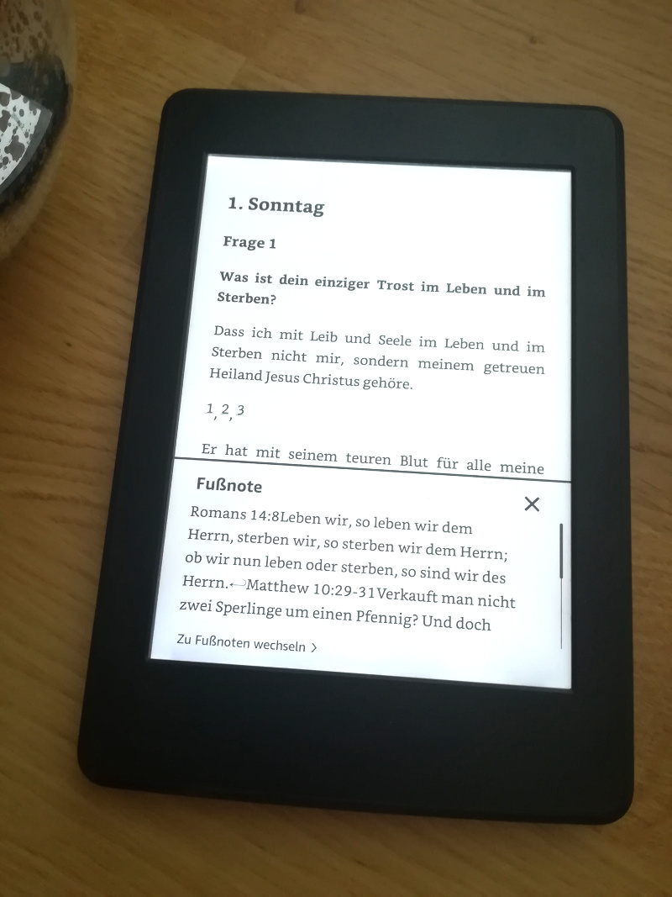

# Heidelberger Katechismus

> Was ist dein einziger Trost im Leben und im Sterben?

Als Ebook für überall hin.

## Features
angereichert mit Fussnoten links, welche die zugrunde liegenden Schriftstellen anzeigen (Schlachter).

## Based on
- [The SWORD Project](http://crosswire.org/sword/index.jsp)
- Schlachter Bibel (1951)
- [heidelberger-katechismus.net](https://www.heidelberger-katechismus.net)

## Dev environment
- Debian based operating system (Ubuntu/Mint)
- Xiphos to download offline bible modules
- Java 11 JDK + Maven (+ Eclipse IDE) to transform and manipulate HTML dom
- Pandoc to manufacture Ebook: HTML > MD > Epub
- [Calibre](https://calibre-ebook.com) to view ebooks or transcode to Kindle format (Epub>AZW3)

## Getting started
- Run Xiphos and install module `DE: Schlachter (1951)`
- run `./build.sh` and may install dependent binaries used in it.